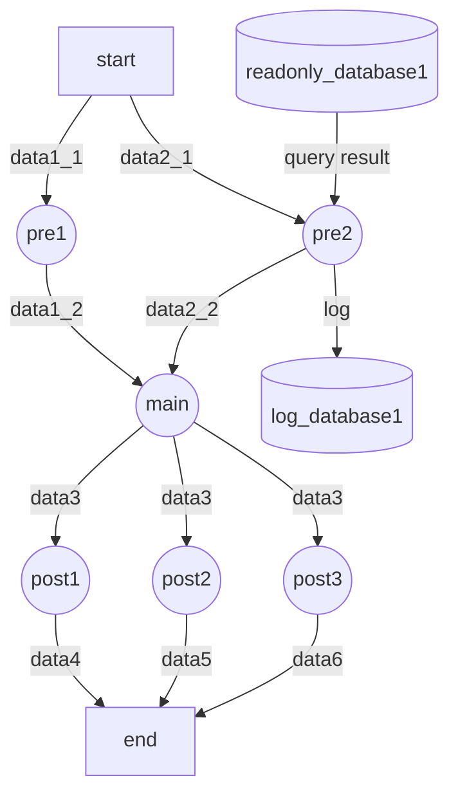

# Mermaid

```mermaid
flowchart TB
    s[start]
    e[end]

    pre1((pre1))
    pre2((pre2))

    main((main))

    post1((post1))
    post2((post2))
    post3((post3))

    s -- data1_1 --> pre1 -- data1_2 --> main
    s -- data2_1 --> pre2 -- data2_2 --> main

    main -- data3 --> post1 & post2 & post3

    post1 -- data4 --> e
    post2 -- data5 --> e
    post3 -- data6 --> e

    readonly_db1[(readonly_database1)] -- query result --> pre2
    pre2 -- log --> log_db[(log_database1)]
```
